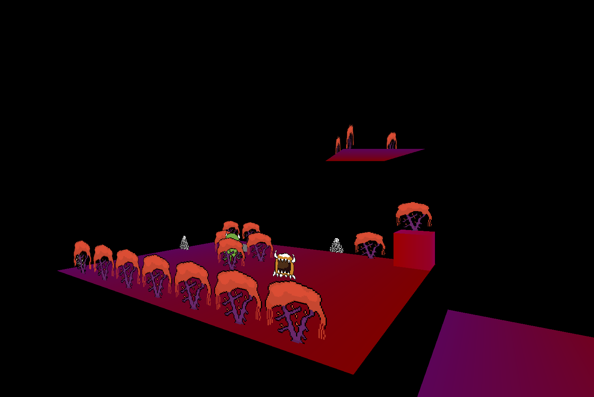

# untitled 👿demon game
 

## Licenses

This project contains assests which were obtained from [OpenGameArt.org](https://opengameart.org).

### Assets:

**Title:** [15 Melodic RPG Chiptunes](https://opengameart.org/content/15-melodic-rpg-chiptunes)

**Author:** [Aureolus_Omicron](https://opengameart.org/users/aureolusomicron)

**URL:** [https://opengameart.org/content/15-melodic-rpg-chiptunes](https://opengameart.org/content/15-melodic-rpg-chiptunes)

**License(s):** CC0 ( [https://creativecommons.org/publicdomain/zero/1.0/](https://creativecommons.org/publicdomain/zero/1.0/) )

----

**Title:** [Onscreen controls (8 styles)](https://opengameart.org/content/onscreen-controls-8-styles)

**Author:** [Kenney.nl](https://www.kenney.nl)

**URL:** [https://opengameart.org/content/onscreen-controls-8-styles](https://opengameart.org/content/onscreen-controls-8-styles)

**License(s):** CC0 ( [https://creativecommons.org/publicdomain/zero/1.0/](https://creativecommons.org/publicdomain/zero/1.0/) )

### Engine:

This game is made with Godot which is [licensed under the MIT license](https://godotengine.org/license/).
